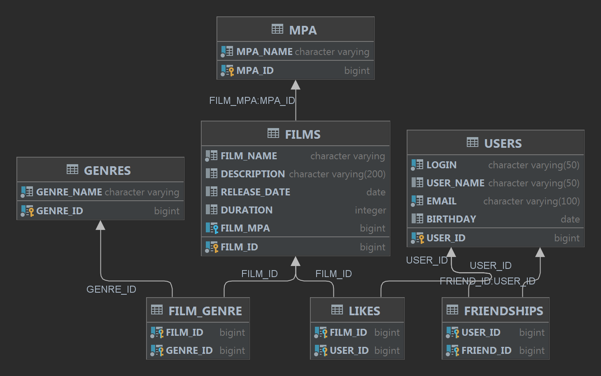

# java-filmorate

Диаграмма планируемой базы данных для filmorate:

Ссылка на диаграмму - https://dbdiagram.io/d/62de18320d66c746553f8aac

### Примеры запросов в БД для основных операций вашего приложения:

#### Получить всех пользователей
SELECT *  
FROM user AS u  
#### Получить все фильмы, с жанрами и возрастными ограничениями
SELECT *  
FROM films AS f  
LEFT JOIN film_genre AS fg ON f.film_id = fg.film_id  
LEFT JOIN genre AS g ON fg.genre_id = g.genre_id  
LEFT JOIN film_mpa AS fm ON f.film_id = fm.film_id  
LEFT JOIN mpa AS m ON fm.mpa_id = m.mpa_id  
#### Получить топ 10 фильмов
SELECT f.title AS title  
       COUNT (l.film_id) AS likes
FROM films AS f  
LEFT JOIN likes AS l ON f.film_id = l.film_id  
GROUP BY title  
ORDER BY likes DESC  
LIMIT 10  
#### Получить список общих друзей для пользователей с id = 1 и id = 2
SELECT u.user_id,  
       u.name,  
       fa.second_friend_id as friend_id,  
       u2.name  
FROM user AS u  
LEFT JOIN friendship AS fa ON u.user_id = fa.first_friend_id  
WHERE u.user_id = '1'  
      or u.user_id = '2'  
HAVING COUNT(friend_id) > 1  